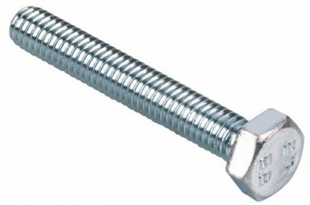
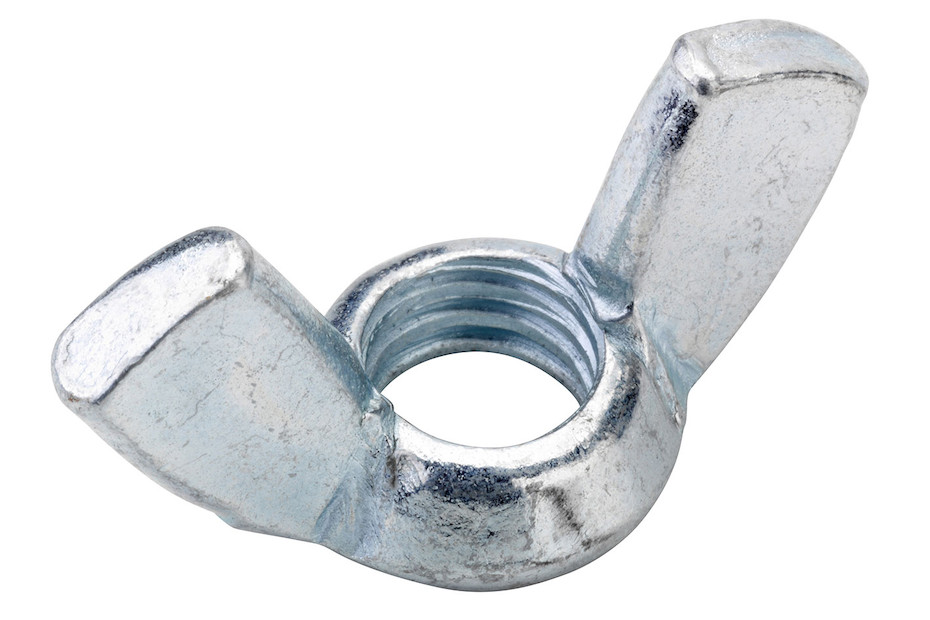
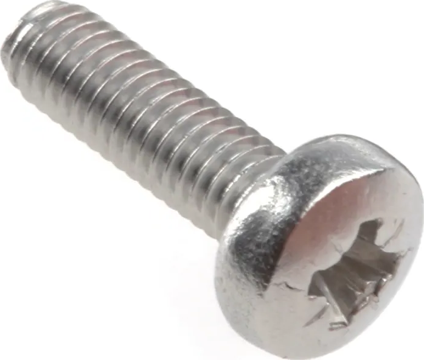
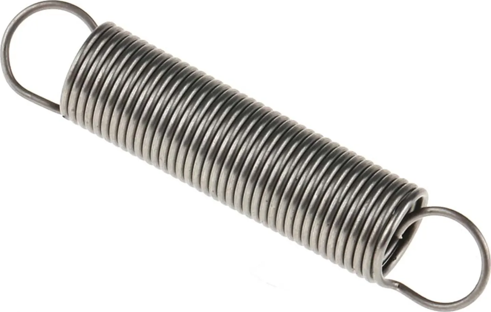
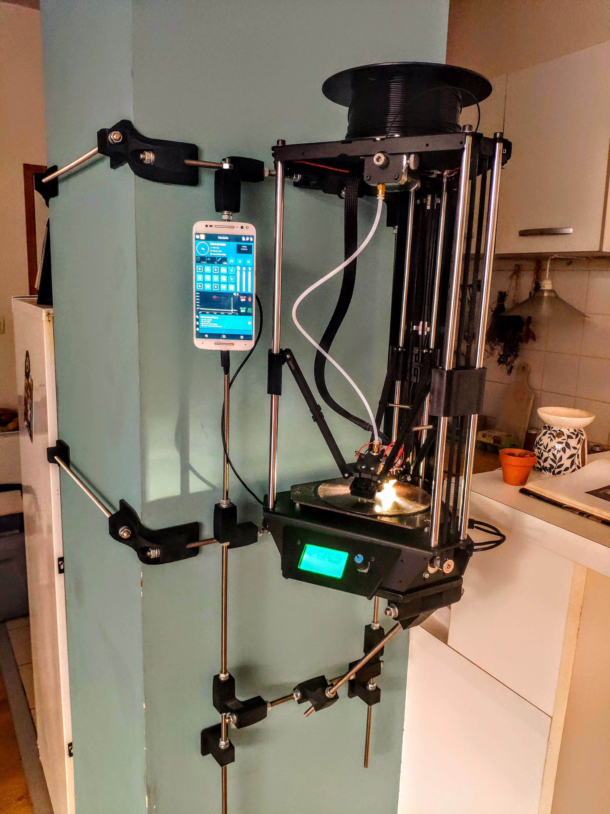
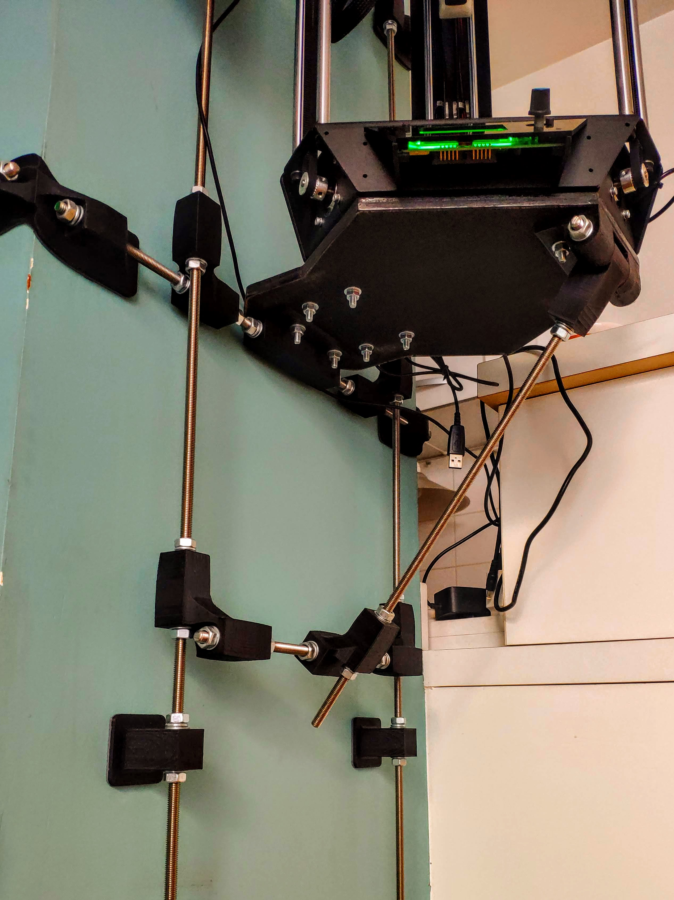
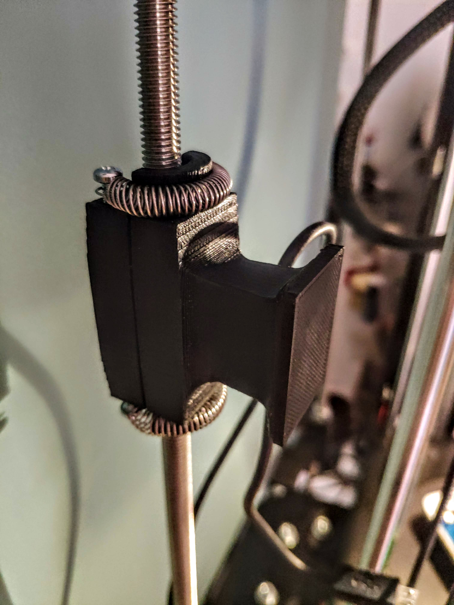
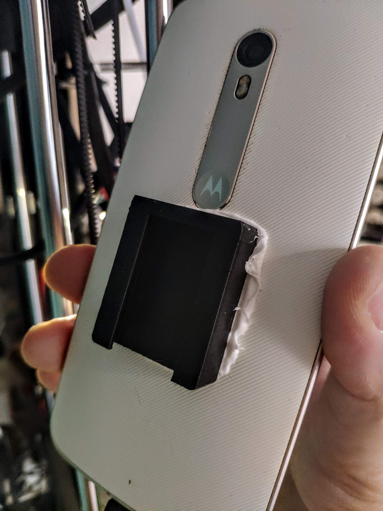
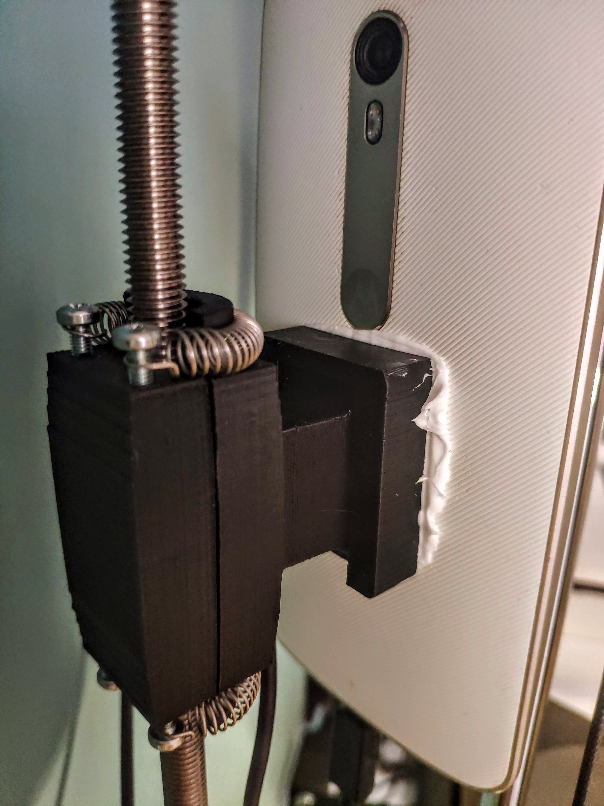

# printeRAcK

Project page of a rack built with 3d printed parts.

This mount was originally designed to set a [Microdelta Rework](https://www.reprap-france.com/produit/1234568619-imprimante-3d-microdelta-rework) ([3d model](https://sketchfab.com/3d-models/micro-delta-rework-by-emotion-tech-91a2beeb78f4422ebaeff0f6781fef17)) on a pole.

[Download 3d parts](https://github.com/benjamin-feron/printeRAcK/raw/main/3d_parts.zip)

  [>> View project on Thingiverse <<](https://www.thingiverse.com/thing:4943958){:target="_blank"}

## Objective

## 3d printed parts

  
  

  
  

  
  

  
  

  
  

  
  

## Wood parts

  

  

## Hardware

| Part                   |                                                                                            | Qty |
|:-----------------------|:------------------------------------------------------------------------------------------:|:---:|
| Threaded shaft M8x1000 |  | 2   |
| Threaded shaft M8x555  |  | 2   |
| Threaded shaft M8x500  |  | 8   |
| Threaded shaft M8x400  |  | 1   |
| Threaded shaft M8x300  |  | 1   |
| Threaded shaft M8x120  |  | 1   |
| Screw M6x25            |  | 8   |
| Screw hex head M8x50   |  | 1   |
| Washer M8              |  | 69  |
| Washer M6              |  | 8   |
| Washer spring M8       |  | 43  |
| Nut M8                 |  | 71  |
| Nut M6                 |  | 8   |
| Wing nut M8            |  | 1   |

## Design details

## Accessories

### Smartphone dock

  
  
  

| Part        |                                                                                    | Qty |
|:------------|:----------------------------------------------------------------------------------:|:---:|
| Screw M3x10 |  | 4   |
| Spring 6x20 |  | 2   |

## Building irl

