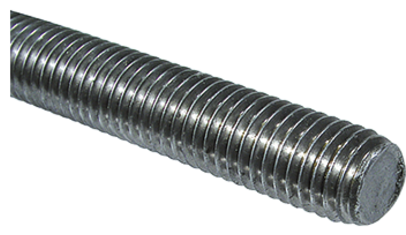
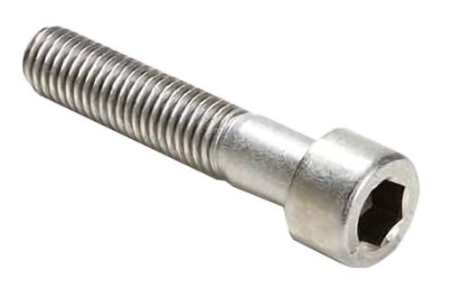
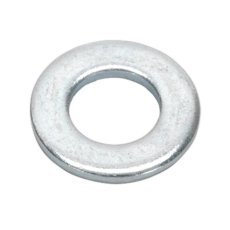
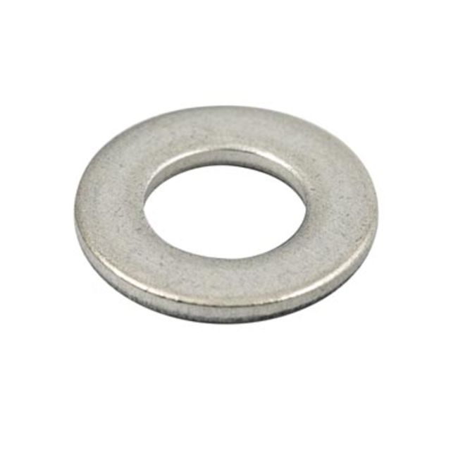
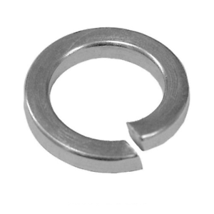
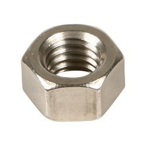
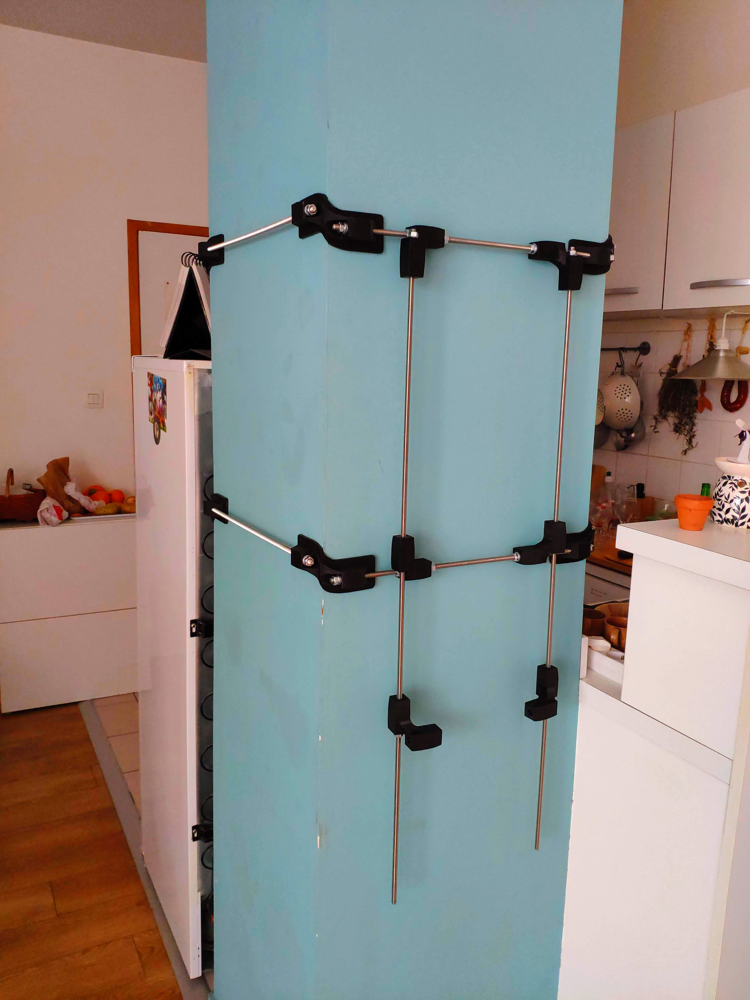

# printeRAcK

Project page of a rack built with 3d printed parts.

This mount was originally designed to set a [Microdelta Rework](https://www.reprap-france.com/produit/1234568619-imprimante-3d-microdelta-rework) ([3d model](https://sketchfab.com/3d-models/micro-delta-rework-by-emotion-tech-91a2beeb78f4422ebaeff0f6781fef17)) on a pole.

## Objective

## 3d printed parts

  
  

  
  

  
  

  
  

  
  

  
  

Available for download soon...

## Hardware

| Part                  |                                                                                            | Qty |
|:----------------------|:------------------------------------------------------------------------------------------:|:---:|
| Threaded shaft M8x820 |  | 2   |
| Threaded shaft M8x525 |  | 2   |
| Threaded shaft M8x500 |  | 8   |
| Threaded shaft M8x320 |  | 2   |
| Threaded shaft M8x125 |  | 1   |
| Screw M6x25           |  | 8   |
| Washer M8             |  | 69  |
| Washer M6             |  | 8   |
| Washer spring M8      |  | 43  |
| Nut M8                |  | 70  |
| Nut M6                |  | 8   |

## Design details

## Building irl (in progress...)

